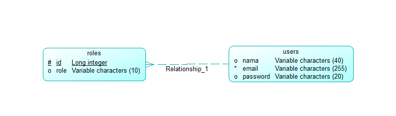

# ETS-PBKK-D

# DESIGN

## I. DATABASE DESIGN

1. CDM (CONCEPTUAL DATA MODEL)

2. PDM (PHYSICAL DATA MODEL)

## II. PSEUDO CODE

1. UserController (for managing CRUD and view functions in users list)
2. class UserController extends Controller

	- `index() // viewing list`
	- `create() // inserting a new user data`
	- `edit() // viewing editing form`
	- `update() // updating a user data`
	- `delete() // deleting user data`
